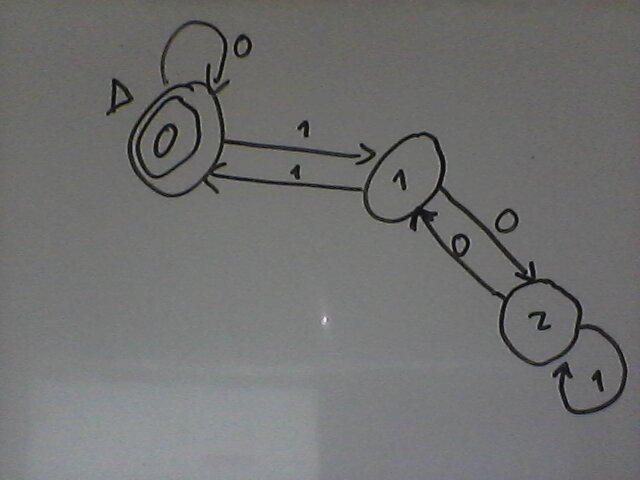
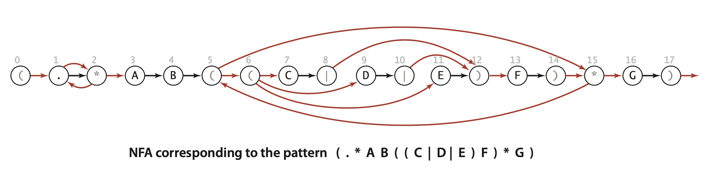

# Interview Questions: Regular Expressions

## ****Question 1****

**Challenging REs.** Construct a regular expression for each of the following languages over the binary alphabet or prove that no such regular expression is possible:

It is recommended to test the REs by the following Class

```java
public class Validate { 
    public static void main(String[] args) { 
        String regexp = args[0];
        String text   = args[1];
        System.out.println(text.matches(regexp));
    }
}
```

```bash
javac Validate.java
java Validate pattern text
```

<aside>
💡 Hint: two are not possible (equal number of 0s and 1s; palindromes).

</aside>

<aside>
💡 Reference:
1. [https://cs.stackexchange.com/questions/47711/what-is-the-regular-expression-describing-this-language](https://cs.stackexchange.com/questions/47711/what-is-the-regular-expression-describing-this-language)
2. [https://stackoverflow.com/questions/844867/check-if-a-number-is-divisible-by-3](https://stackoverflow.com/questions/844867/check-if-a-number-is-divisible-by-3)
3. [https://courses.engr.illinois.edu/cs374/fa2020/lec_prerec/02/2_2_1.pdf](https://courses.engr.illinois.edu/cs374/fa2020/lec_prerec/02/2_2_1.pdf)

</aside>

- All strings except 11 or 111.
    
    **RE = (0(0|1)|1|10(0|1)|110(0|1)*|111(0|1)+)?**
    
- Strings with 1 in every odd-number bit position.
    
    **RE = ((.1)+|1(.1)*)**
    
- Strings with an equal number of 0s and 1s.
    
    **not possible**
    
- Strings with at least two 0s and at most one 1.
    
    **RE = (0+1{0,1}0+|0*1{0,1}00+|00+1{0,1}0*)**
    
- Strings that when interpreted as a binary integer are a multiple of 3.
    
    **RE = 0*((1(01*0)*1)*0*)***
    
<p align="center">
    
</p>

- Strings with no two consecutive 1s.
    
    **RE = “1{0,1}(0|01)*”**
    
- Strings that are palindromes (same forwards and backwards)
    
    **not possible**
    
- Strings with an equal number of substrings of the form 01 and 10.
    
    **RE = (00*(11*0)*)?|(11*(00*1)*)?**
    
<p align="center">
    
</p>


## ****Question 2****

**Exponential-size DFA.** Design a regular expressions of length *n* such that any DFA that recognizes the same language has an exponential number of states

<aside>
💡 HInt: $n^{th}$-to-the-last bit equals 0

</aside>

<aside>
💡 Reference:
1.[https://en.wikipedia.org/wiki/Nondeterministic_finite_automaton](https://en.wikipedia.org/wiki/Nondeterministic_finite_automaton)
2.[https://www.cs.columbia.edu/~tal/3261/sp17/expdfa.pdf](https://www.cs.columbia.edu/~tal/3261/sp17/expdfa.pdf)

</aside>

## Answer

For an arbitrary n ∈ N, define the language Ln = {w ∈ {0, 1}∗ |  the n-th to last symbol in w is 1}

Define the NFA Nn = ({q0, . . . , qn}, {0, 1}, δ, q0, {qn}) where δ is defined as follows:

- δ(q0, 0) = {q0}
- δ(q0, 1) = {q0, q1}
- δ(qi, a) = {qi+1} ∀i ∈ {1, . . . , n − 1}, a ∈ {0, 1}
- δ(qn, a) = ∅ ∀a ∈ {0, 1}

⇒ Nn recognizes the language Ln.

Check the reference 2 for the proof that for any n ∈ N, any DFA recognizing the language Ln must have at least 2^n states.

## ****Question 3****

**Extensions to NFA.** Add to [NFA.java](http://algs4.cs.princeton.edu/54regexp/NFA.java.html) the ability to handle 

- multiway or
<p align="center">
    
</p>

- (.) wildcard
- the + closure operator.

⇒ two **ε-transtions from + to its previous and next letters**

<aside>
💡 Hint: think about how you need to modify the digraph for multiway or and the + closure operator. What other changes to the algorithm do you need to make?

</aside>
